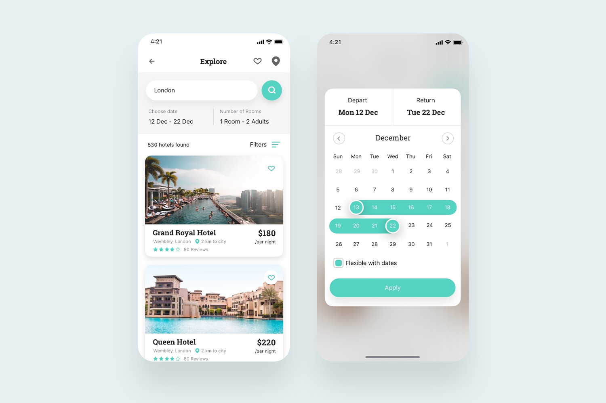

# React-Native-UI-Templates

React native UI templates inspired from [Best-Flutter-UI-Templates](https://github.com/mitesh77/Best-Flutter-UI-Templates)

## Try The App

See how to setup and run for Android & iOS [here](https://reactnative.dev/docs/next/environment-setup).

### Expo

You can run it in [Expo](https://docs.expo.io) [here](https://snack.expo.io/@ashu_dubey/react-native-ui-templates) (Not handled for web yet).

### Some Screenshots

