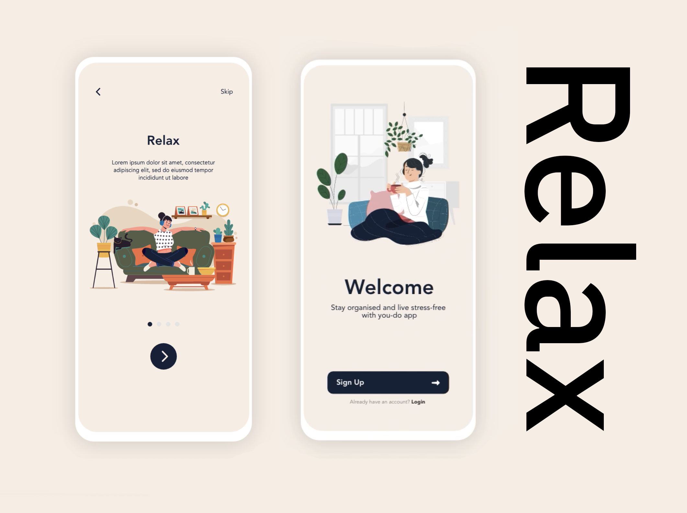

# Animated Onboarding Template

  

An onboarding UI template with smooth animations, for a Mental Wellness App.

## 📦 Packages used

1. [react-native-vector-icons](https://github.com/oblador/react-native-vector-icons):- Google Material icons.
2. [react-native-safe-area-context](https://github.com/th3rdwave/react-native-safe-area-context):- Handle UI for iOS safe area.

## 🌻 Motivation

Original UI design for this template on [Behance](<https://www.behance.net/gallery/96755139/Mental-Wellness-App-(Onboarding)>).

## 🔗 Links

- [UI on Behance](<https://www.behance.net/gallery/96755139/Mental-Wellness-App-(Onboarding)>)
- **Demo: [twitter](https://twitter.com/aashudubey_ad/status/1580260456215695360) \| [youtube](https://youtube.com/shorts/AOD9FyiSR3U)**
